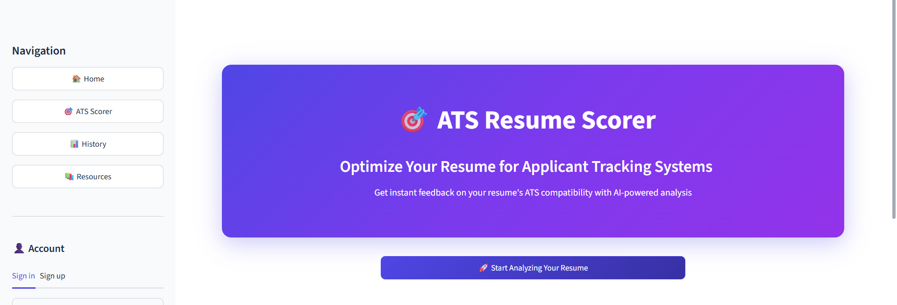
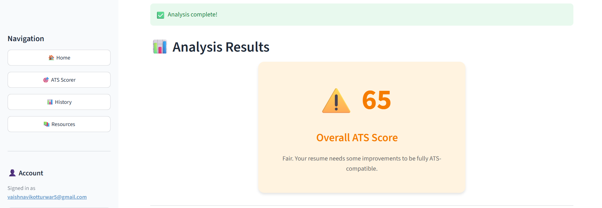
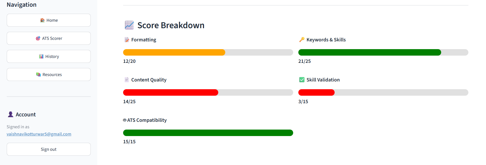
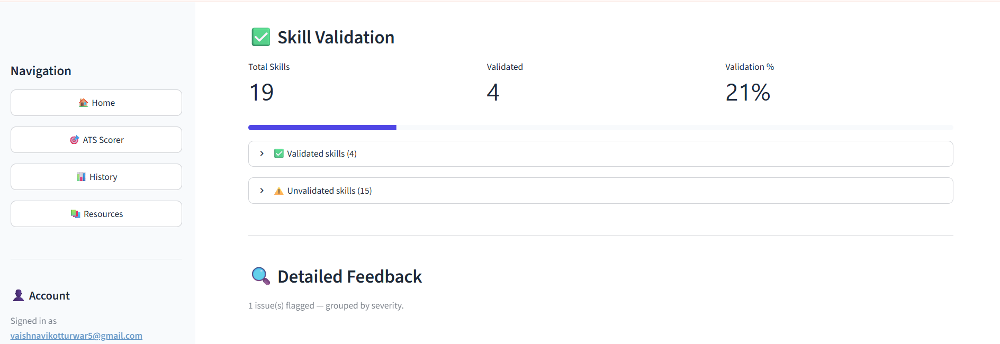
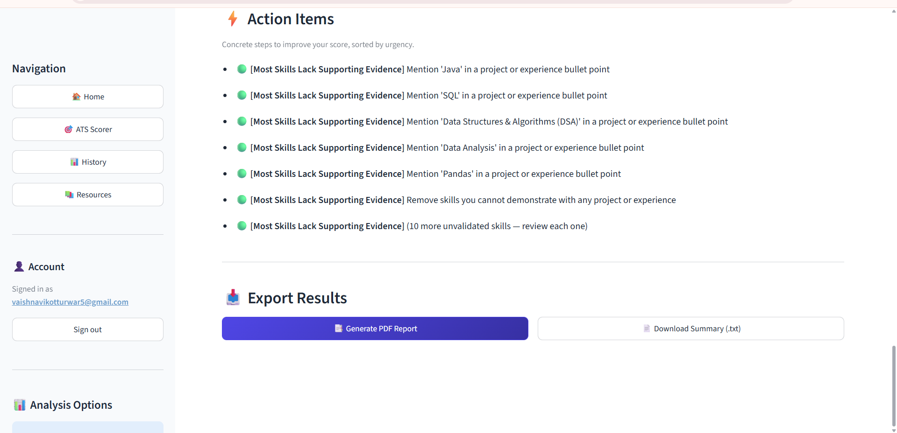
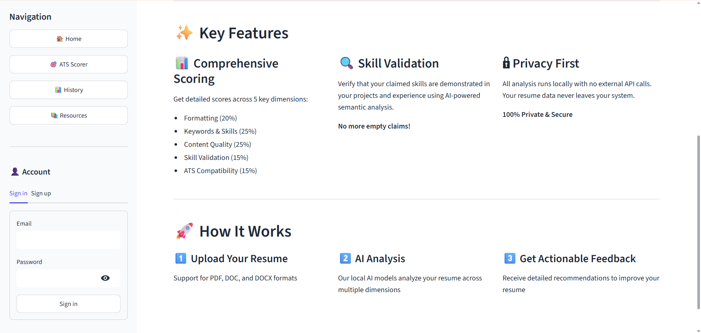

# 🎯 ATS Resume Scorer

An AI-powered full-stack web app that scores how well your resume matches a job description and gives you actionable feedback to improve it.



---

## ✨ What It Does

Upload your resume (PDF/DOC/DOCX), paste a job description, and get:

- **ATS Score out of 100** across 5 key dimensions
- **Keyword & skill gap analysis** between your resume and the JD
- **Skill validation** — checks if your claimed skills are backed by evidence in your projects/experience
- **Specific action items** to improve your score
- **PDF & TXT report export**

---

## 📸 Screenshots

| Landing Page | ATS Score |
|---|---|
|  |  |

| Score Breakdown | Skill Validation |
|---|---|
|  |  |

| Action Items | Export |
|---|---|
|  |  |

---

## 🛠️ Tech Stack

| Layer | Technology |
|---|---|
| Frontend | Streamlit |
| Backend | FastAPI |
| NLP | spaCy (`en_core_web_md`), Sentence Transformers (`all-MiniLM-L6-v2`) |
| LLM Feedback | Groq API (LLaMA 3) |
| Auth + Database | Supabase |
| PDF Export | WeasyPrint + Jinja2 |

---

## 📁 Project Structure

```
ai-resume-ats/
├── backend/
│   ├── api/          # FastAPI routes and auth
│   ├── core/         # Config and environment
│   ├── database/     # Supabase integration
│   ├── models/       # Pydantic schemas
│   ├── services/     # NLP pipeline, ATS scorer, Groq parser
│   ├── templates/    # HTML report templates
│   └── utils/        # File handling, matching utilities
├── frontend/
│   ├── components/   # Streamlit UI components
│   ├── services/     # API client, Supabase client
│   └── views/        # Page views (scorer, history, resources)
├── jupyter notebooks/ # EDA and BERT experiments
├── requirements.txt
└── .env.example
```

---

## ⚙️ Setup & Installation

### 1. Clone the repository
```bash
git clone https://github.com/vaishnavikotturwar/ai-resume-ats.git
cd ai-resume-ats
```

### 2. Create a virtual environment
```bash
python -m venv venv

# Windows
venv\Scripts\activate

# Mac/Linux
source venv/bin/activate
```

### 3. Install dependencies
```bash
pip install -r requirements.txt
python -m spacy download en_core_web_md
```

### 4. Configure environment variables
Create a `.env` file in the project root:
```
SUPABASE_URL=your_supabase_project_url
SUPABASE_KEY=your_supabase_service_role_key
SUPABASE_ANON_KEY=your_supabase_anon_key
SUPABASE_JWT_SECRET=your_supabase_jwt_secret
GROQ_API_KEY=your_groq_api_key
```

You'll need:
- A free [Supabase](https://supabase.com) project for auth + database
- A free [Groq](https://console.groq.com) API key for LLM feedback

### 5. Run the backend
```bash
uvicorn backend.main:app --reload --host 0.0.0.0 --port 8000
```

### 6. Run the frontend (new terminal)
```bash
streamlit run frontend/streamlit_app.py
```

Open **http://localhost:8501** in your browser.

---

## 🚀 Features

- ✅ Resume parsing (PDF, DOC, DOCX)
- ✅ Semantic similarity scoring using Sentence Transformers
- ✅ Keyword extraction and matching with spaCy
- ✅ LLM-generated improvement suggestions via Groq
- ✅ User authentication via Supabase
- ✅ Analysis history saved per user
- ✅ PDF and TXT report export

---

## 👩‍💻 Author

**Vaishnavi Kotturwar**  
3rd Year CS Student | AI/ML Enthusiast  
[LinkedIn](https://linkedin.com/in/vaishnavikotturwar) • [GitHub](https://github.com/vaishnavikotturwar)

---

## 📄 License

This project is open source and available under the [MIT License](LICENSE).
